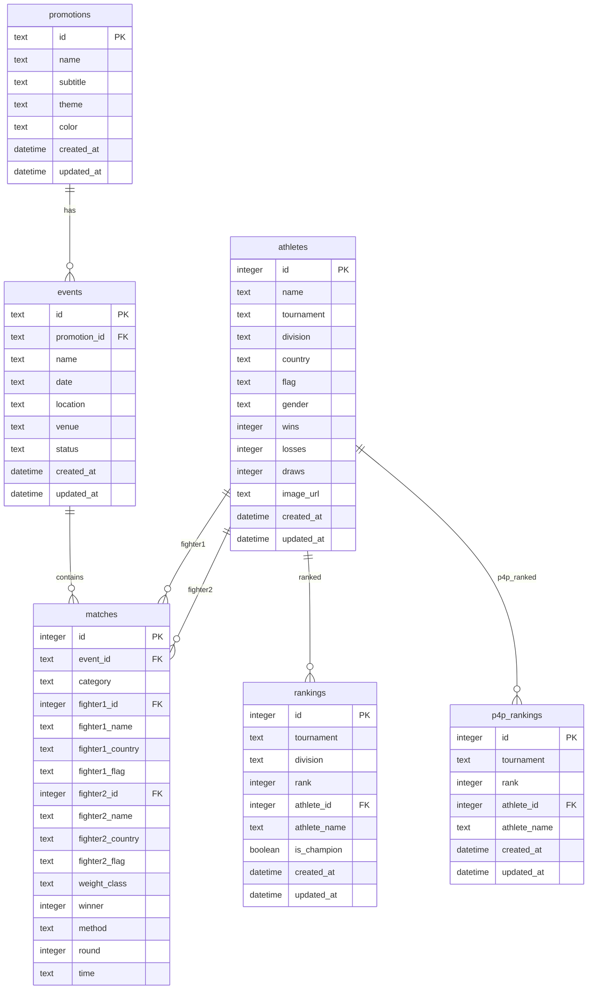

# MMA Tournament Database ER Diagram

## Relationships

| From | To | Type | Description |
|------|-----|------|-------------|
| events.promotion_id | promotions.id | Many-to-One | Events belong to a promotion (cascade delete) |
| matches.event_id | events.id | Many-to-One | Matches belong to an event (cascade delete) |
| matches.fighter1_id | athletes.id | Many-to-One | First fighter in a match |
| matches.fighter2_id | athletes.id | Many-to-One | Second fighter in a match |
| rankings.athlete_id | athletes.id | Many-to-One | Athlete's division ranking |
| p4p_rankings.athlete_id | athletes.id | Many-to-One | Athlete's pound-for-pound ranking |
